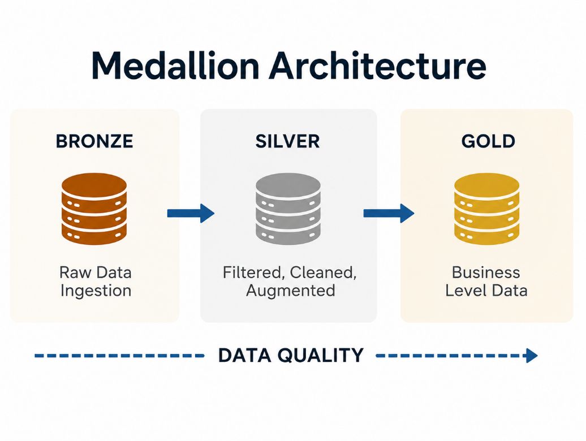
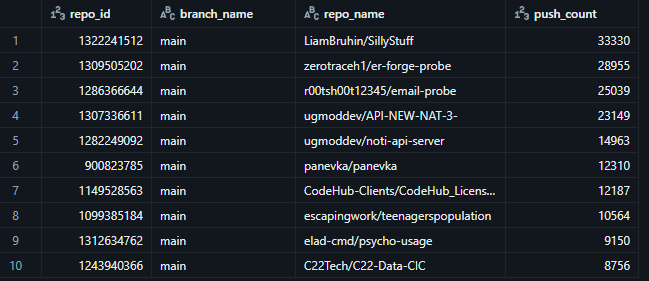
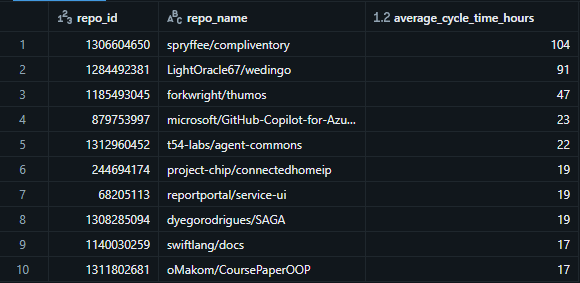
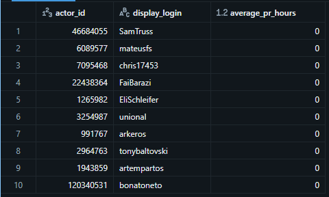
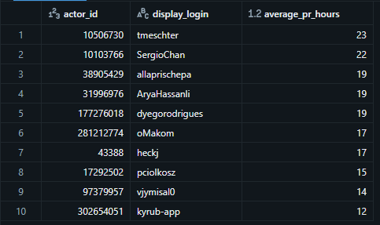
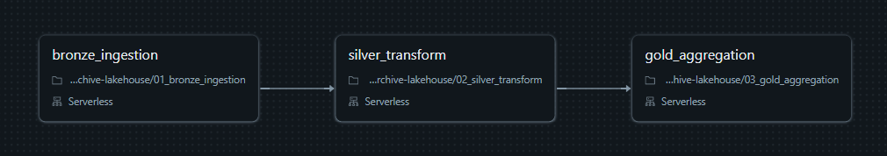

# GH Archive Lakehouse Pipeline

## Executive Summary

This pipeline is an ELT built on Databricks to translate the raw public GitHub events stream from the GH Archive into a queryable star schema via a Bronze/Silver/Gold medallion architecture. During one week (8/3/2026 - 8/9/2026), 23.8MM raw events were ingested, filtered to (pushes, pull request activity, issue comment activity), and the resulting Gold tables were validated against three business questions:

1. Which repos and branches see the most push activity?
2. How long does it take for a PR to go from open to closed?
3. How does pull request cycle time differ by contributor?

The pipeline is run as three sequential tasks in one Databricks Job on serverless, utilizes a quarantine pattern to avoid silently dropped data and maintain data quality transparency, and is run as a one-off batch over one historical week rather than a real time feed (explained in Technical Decisions and Trade-offs).

## Problem/Context

GitHub produces an enormous stream of public data based on all the activity occurring across their platform. However, because they have a severely rate-limited public API, at only 5,000 requests per hour, analyzing that stream of historical data directly against the API is unfeasible for bulk analysis. GH Archive, a community-driven project, logs and archives public event stream in large hour-long downloadable archives to combat this, and this project uses GH Archive for its data and builds an ELT process against the archive which turns this stream of events into an answerable star schema.

## Architecture Overview

## Data Source and Scope

**About GH Archive**
The data for this project comes from [GH Archive](https://www.gharchive.org/), an independent, open-source project created by developer Ilya Grigorik. Since 2011, GH Archive has continuously recorded GitHub's public activity stream and made it freely available as downloadable files, one file per hour, going back over a decade. It exists specifically to solve the problem this project was built around: GitHub's live API is too rate-limited for bulk historical analysis, but GH Archive's archived files are not.

GH Archive captures over 15 different kinds of public GitHub activity, everything from code pushes and new commits, to repository forks, issue comments, and new project members. Each hourly archive file contains these events encoded as JSON, exactly as originally reported by the GitHub API. ([DEV Community](https://dev.to/changelog/144-github-archive-and-changelog-nightly-with-ilya-grigorik))

**What this project actually uses**
Out of GH Archive's full range of event types, this pipeline narrows in on the three most relevant to understanding repository activity and pull request health:

| Event Type | What it represents |
|---|---|
| Push Event | A contributor pushes new code to a repository |
| Pull Request Event | A pull request is opened, closed, or merged |
| Issue Comment Event | A comment is added to a pull request or issue |

**Time window**
The pipeline currently covers one full week of GitHub activity, **August 3–9, 2026**, downloaded and processed as a single historical batch rather than a continuously updating feed. This window was large enough to produce a meaningful dataset (roughly 23.8 million raw events) while staying within the practical limits of a free-tier Databricks environment.

## Data Quality

Not every record collected from GitHub arrives complete. Fields can be missing, malformed, or absent depending on how GitHub reported the original event. Rather than silently dropping incomplete records — which would make the dataset quietly less trustworthy over time, this pipeline uses a **quarantine pattern**: anything that fails a quality check is routed to a separate holding table instead of being discarded or allowed to pollute downstream tables.

**How records are checked**
When raw data is cleaned and flattened in the Silver layer, each event is checked against two rules:

1. **Missing core identifiers** — a record is quarantined if it's missing any of the fields needed to reliably identify or join it: the event ID, event type, actor (user) ID, or repository ID.
2. **Incomplete pull request data** — for Pull Request Events specifically, a record is also quarantined if it's missing the pull request number, since that field is essential for tracking a PR's lifecycle in the Gold layer.

Records that pass both checks flow into the main `silver_events` table. Records that fail either check are copied into a separate `silver_events_quarantine` table, preserving the key identifying fields so they can be reviewed later.

**Visibility, not silence**
After the quarantine table is built, the pipeline counts how many rows landed there and prints a warning if that count is greater than zero. This means a run with data quality problems doesn't fail silently — anyone monitoring the pipeline logs sees a clear signal that something in the raw data needs review.

**Current results**
On the most recent run, the quarantine table came back **empty (0 rows)**. Out of roughly 23.8 million raw events ingested in the Bronze layer, every record that matched the three in-scope event types (Push, Pull Request, and Issue Comment) had complete, usable data for its core identifiers and — where applicable — its pull request number. This indicates the source data for this time window was clean and that the transformation logic in the Silver layer is correctly handling the fields it depends on.

## Key Findings

With the star schema in place, three business questions were used to validate the pipeline and surface early insights from the August 3–9, 2026 dataset.

### 1. Most active repos/branches by push activity

Every one of the top 10 repos shows all push activity concentrated on the main branch, no other branch names appear at all in this top-10 view. This suggests either a dataset dominated by simple, direct-to-main workflows (rather than feature-branch workflows), or that many of the most "active" repos by raw push count are automated, bot-driven, or non-standard projects (several names: er-forge-probe, email-probe, repos with generic or credential-like naming) rather than typical collaborative open-source projects. This is worth a follow-up look before treating raw push count alone as a proxy for "healthy" repo activity.

### 2. Longest average PR cycle time, by repo

Cycle time, the time between a PR being opened and closed, varies widely across repos, from over four days (104 hours) down to under a day. The longest cycle times belong to lower-profile repos, while a recognizable, larger organization (Microsoft) appears further down the list with a comparatively fast 23-hour average, hinting that larger, more established projects may have more consistent review processes. With only a handful of PRs per repo in this one-week window, these averages should be read as directional rather than statistically robust.

### 3. Fastest and slowest PR cycle time, by contributor

*Fastest (ascending):*

*Slowest (descending):*

The fastest contributors show an average PR cycle time of effectively 0 hours, meaning their pull requests were opened and closed within the same hour. This could reflect very small, low-risk changes merged quickly, but combined with Finding 1's pattern, it may also indicate automated or bot-driven PR activity rather than typical human review cycles. The slowest contributors top out around 23 hours, roughly a full business day — a much narrower spread than the repo-level cycle times in Finding 2.

## Orchestration

The three notebooks are tied together into a single Databricks **Job** named `gh_archive_lakehouse_pipeline`, which runs them in a defined sequence rather than as separate, manually-run notebooks.

**Task sequence**
The job is structured as three dependent tasks, each mapped to one notebook:

Each task only starts after the one before it finishes successfully. This ordering matters because each layer depends entirely on the output of the one before it — Silver reads from the Bronze table, and Gold reads from the Silver table, so running them out of order, or in parallel, could produce incomplete or stale results.

**Compute**
All three tasks run on **Serverless** compute, meaning Databricks automatically provisions and manages the underlying infrastructure for each run rather than relying on a manually configured, always-on cluster. This keeps the job lightweight and cost-efficient, which fits the free-tier constraint noted in the Architecture Overview.

**Scheduling**
At present, the job has **no schedule or trigger configured** — it's set to run on demand ("Run now") rather than automatically on a recurring basis. This is consistent with the project's scope as a one-time historical analysis over a fixed week of data (August 3–9, 2026), rather than an ongoing, continuously updating pipeline.

**Lineage**
Databricks' built-in lineage tracking shows the job touching 2 upstream tables and 7 downstream tables in total, confirming the full chain from raw ingestion through to the final Gold-layer star schema is captured and traceable end-to-end within the platform.

## Technical Decisions and Trade-offs

This section documents the key design choices made while building this pipeline, along with the trade-offs each one carries.

**Using GH Archive as a public dataset**
GH Archive is a free, publicly accessible dataset, no authentication, API keys, or licensing agreements are required to download it. This made it an easy fit for this project's goals, but it also comes with trade-offs worth noting: the data reflects only *public* GitHub activity (private repos are excluded entirely), and GH Archive itself is a third-party, community-maintained project rather than an official GitHub product, so its long-term availability and schema stability aren't guaranteed by GitHub.

**Quarantine instead of dropping bad records**
As covered in Data Quality, invalid records are routed to a separate table rather than deleted. This adds a small amount of extra logic and storage, but preserves an audit trail and makes data issues visible instead of hiding them, a trade-off favoring transparency over pipeline simplicity.

**Overwrite vs. incremental loading**

This pipeline uses CREATE OR REPLACE TABLE (full overwrite) rather than incremental MERGE/append logic at every layer. This was a deliberate choice for the project's current scope: with a fixed, one-time historical batch (a 7-day GH Archive window), overwrite guarantees a clean, reproducible result on every run, critical during active development, where re-running cells multiple times while debugging could otherwise silently duplicate data under an append-only approach.

The downside is cost and runtime. Since overwrite re-processes the entire dataset every time it runs, and the historical window gets bigger or if the pipeline switches from the current batch to an ongoing, scheduled ingestion, the amount of data reprocessed per run will grow exponentially. A production-ready version handling continuous data can then swap out overwrite for MERGE (or use Databricks Autoloader in the Bronze layer).

**Only capturing completed pull requests in Fact_PR_Lifecycle**
The PR lifecycle fact table filters to rows where `closed_at IS NOT NULL`, meaning it only includes pull requests that were closed or merged within the dataset's time window. Pull requests that were opened but still open (not yet closed) are excluded from this table entirely. This was a deliberate choice to keep `cycle_time_hours` meaningful, an open PR has no cycle time to measure yet, but it also means the table understates total PR volume and can't be used on its own to answer "how many PRs are currently open."

**Serverless compute over a dedicated cluster**
All three notebooks run on Databricks Serverless compute rather than a manually sized, persistent cluster. This avoids idle cluster costs and cluster startup/management overhead, fitting the free-tier constraint from the Architecture Overview, at the cost of less fine-grained control over compute sizing for larger workloads.

## Future Improvements

The trade-offs above reflect deliberate choices for a scoped, one-time, free-tier project. If this pipeline were to grow beyond that scope, these are the changes that would matter most:

- **Move to incremental table updates** — Replace the `CREATE OR REPLACE TABLE` overwrite pattern with `MERGE` or append logic so each run only processes new data, improving cost and runtime efficiency as the historical window grows.
- **Add a recurring schedule** — Configure the Databricks Job with a daily or hourly trigger to turn this from a one-time historical batch into a continuously updating pipeline.
- **Track currently-open pull requests** — Extend Fact_PR_Lifecycle (or add a companion table) to include PRs that haven't closed yet, so the dataset can answer "how many PRs are open right now" in addition to cycle-time questions.
- **Automate data quality alerting** — Replace the printed quarantine-count warning with an actual alert (email or Slack) so data quality issues surface proactively instead of requiring someone to check the job logs.
- **Investigate anomalous high-volume repos** — Follow up on the bot-like or credential-named repos surfaced in Finding 1 to distinguish genuine collaborative activity from automated traffic before using raw push count as a health signal.
